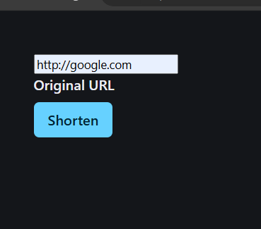
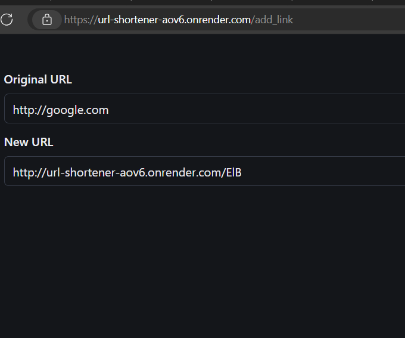
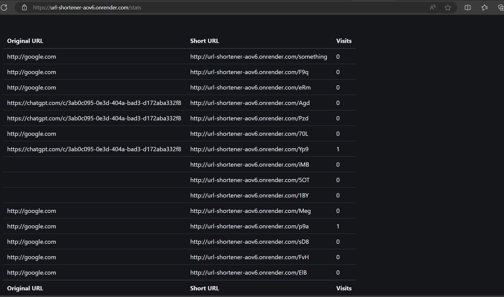

# url-shortener

## at first it asks for verification you should enter ID and password
- no signup feature is available you can take them from .env file

## we should give a link and click on the shorten button

## it redirects you to another page, from there you can view the original and new url

## last three letters will be changed for every websites

## after adding /stats in your link you can view the stats of your link like visits in a table view

